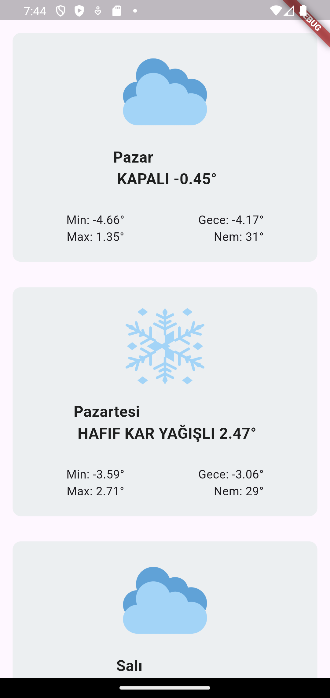

# Weather App

Weather App is a simple Flutter application that retrieves the user's location and displays the current weather. This project fetches city-based weather data through an API and presents it visually in a list format.

---

## Project Structure

```
WEATHER/
|
├── android/
├── build/
├── lib/
│   ├── models/
│   │   └── weather_model.dart         # Weather data model (Data format)
│   │
│   ├── screens/
│   │   └── home_page.dart             # Main screen design and listing
│   │
│   ├── services/
│   │   └── weather_services.dart      # Location fetching and API requests
│   │
│   └── main.dart                      # Application entry point
│
├── test/
│   └── widget_test.dart
│
├── pubspec.yaml                       # Dependencies and project definition
├── assets/
│   └── screenshots/
│       └── screenshot_1.png
├── README.md                          # Project description
└── weather.iml
```

---

## Setup and Run

### Requirements
- Flutter SDK (>=3.0.0)
- Android Studio or Visual Studio Code
- Emulator or Physical Device

### Install Dependencies
Run the following command to install the required dependencies:
```bash
flutter pub get
```

### Project Dependencies
The project uses the following packages as defined in `pubspec.yaml`:
```yaml
dependencies:
  flutter:
    sdk: flutter
  dio: ^5.0.0          # For making HTTP requests
  geolocator: ^9.0.0   # For obtaining user location
  geocoding: ^3.0.0    # For converting location coordinates to city names
```

### API Key
The project fetches weather data from [CollectAPI](https://collectapi.com). To use this service, follow these steps:

1. Register on CollectAPI.
2. Generate an API key for the Weather API.
3. Update the API key in the `weather_services.dart` file under the `authorization` header:

```dart
const Map<String, dynamic> headers = {
  'authorization': "apikey YOUR_API_KEY",
  'content-type': 'application/json',
};
```

---

## Code Overview

### 1. Main Entry Point (`main.dart`)
The application runs the `HomePage` widget as its entry point.
```dart
void main() {
  runApp(const Home());
}
```

### 2. Weather Service (`weather_services.dart`)

#### Features:
- Fetches user location using the `geolocator` package:
```dart
final Position position = await Geolocator.getCurrentPosition();
```
- Retrieves weather data via API:
```dart
final response = await dio.get(url, options: Options(headers: headers));
```

### 3. Main Screen (`home_page.dart`)

#### Features:
- Displays weather data in a list format.
- Each weather item includes:
  - Weather icon
  - Day, temperature, and humidity information.

---

## Running the Application
To run the application, execute the following command:
```bash
flutter run
```

---

## Screenshot


